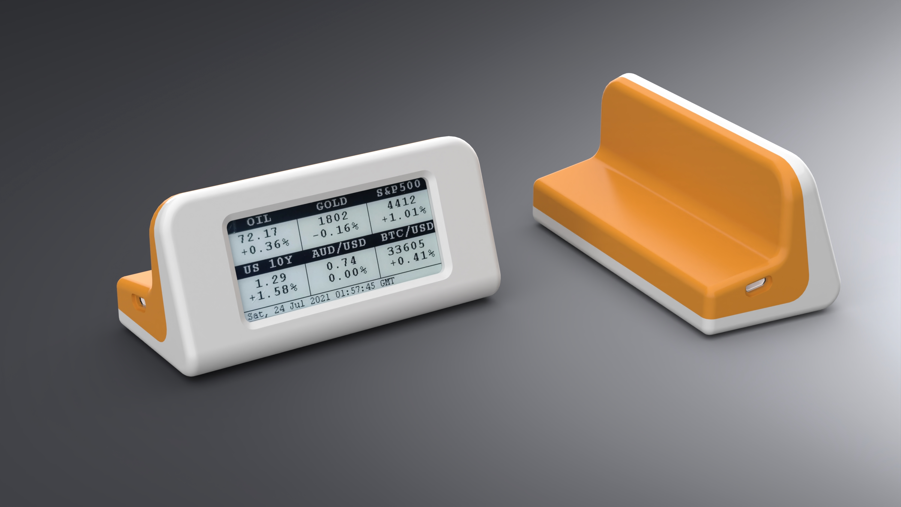
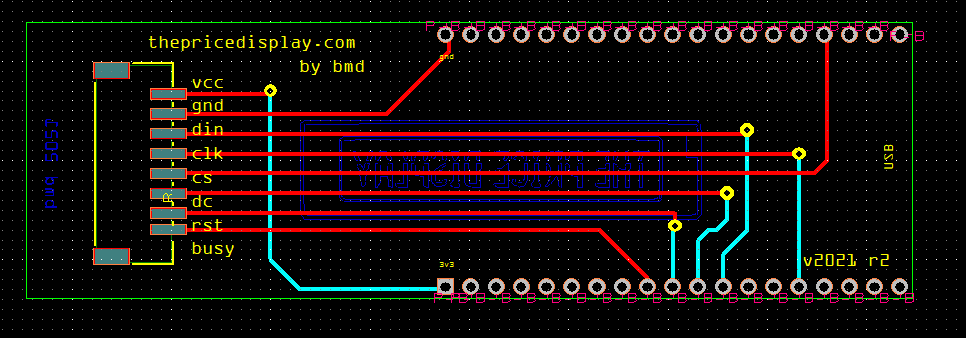

# thepricedisplay Hardware Design

Hardware Design and Data for making the price display hardware, pcb, case and general assembly.

Github repo created on 2021-07-11 in Adelaide.  

Also an awesome challenge, as I havent done a PCB or 3D printed before. 

Goal:
* Make initial batch of 10 price displays! See what I can get for the first few!!
* See if that works, then make 10 more!
* Unit cost needs to be less than $30!

# v2021 - First Iteration of the product** 

* The first thePriceDisplay screen with 6 items on display. 
* based upon Waveshare 2.9" ePaper Screen and an esp32 Dev Module.
* Operates on 115200 baud.

## Design Concept
* Working Small Run Prototype
* Dev Board mounted onto custom PCB which does the translation for the wires to fit nicely. 
* No Battery. Was originally going to have a battery, however the dev boards with orthagonal JST battery connector are not available. I need the USB port to be on a seperate plain to the 2pin battery jst. (USB will extrude through case and JST should be internal). Oh well leave this for ver 2.

## BOM
| Part                                                                        | Cost ea   |
| ----------------------------------------------------------------------------| ----------|
| waveshare screen (2.9")                                                     | $25       | 
| ESP Dev Board                                                               | $5        |
| 8 pin cable from screen to adapter board (8pin, PH (2.0) and 15cm long!)    | $1        |
| Custom Adapter board PCB  ($30/10)                                          | $3.1      |
| JST Connector which goes onto custom PCB (S8B-PH-SM4-TB)                    | $0.1      |               
| Case!!!                                                                     | $15       |
| TOTAL                                                                       | $75       |

## Assembly Instructions
* Solder JST Connector and an 38pin ESP32 (FEIYANG) board together. See below Pins Connection for soldering guide.
* Test each connection between the JST and the ESP32 Pin!
* Prepare Case with Surface Finish and Paint!
    - Sand with 400grit wet/dry sandpaper, in water.
    - ???
    - ??
    - Paint and let dry.
    - Install screen into case. 
    - Install PCB Assembly into case. Scres are XYY and ABZ
    - O Ring on screws.
    - Program PCB with latest arduino code. Custom ID for each item!
    - Load and stop on boot screen
    - Put in bag with USB cable.
    - Put sticker with logo on bag!

## v2021 Part Orders

BOM for 10 items:

| Part                                               |Quantity Needed| Ordered/Have |
|----------------------------------------------------|---------------|--------------|
| Screens                                            | 10            | 1            |
| PCB                                                | 10            | 10           | 
| FEIYANG Board 38pin                                | 10            | 10           |
| PH2.0 Female Double head Connector 10cm Long, 8pin | 10            | 20           |
| JST Connector S8B-PH-SM4-TB                        | 20            | 20           |
| Screws 1.5mm x 5mm - Small End! (2.0mm hole)       | 20            | 50           |
| Screws 2.6mm x 4mm - Screen and big end            | 40            | 50           |
 
The 1.5mm (smaller) screws work great in a 2.0mm Diameter hole.
The 2.6mm screws work well in securing the screen, and the esp32 board.

## Pins Connection to Display 

The pins used on the esp32 Dev board to the Waveshare for working code are as follows:**

| Name               | e-Paper Wire |  ESP32 Pin |
|--------------------|--------------|------------|
| VCC                |  3.3V        |  [Grey]    |
| GND                |  GND         |  [Brown]   |
| DIN                |  GPIO14      |  [Blue]    |
| CLK                |  GPIO13      |  [Yellow]  |
| CS                 |  GPIO15      |  [Orange]  |
| DC                 |  GPIO27      |  [Green]   |
| RST                |  GPIO26      |  [White]   |
| BUSY               |  GPIO25      |  [Purple]  |

## Power Usage
* Sleeps most of the time. So its very power efficient.
* when updating it uses 0.04A (at 5V) using it for an hour on the PC consumed 13mah.
    - i.e. 17.5hrs of continual updating on a 700mah battery! which is only ~1-2% of the total cycle of the device! i.e. battery power is very effective.

## Custom PCB 

Connects esp32 into a S8B-PH-SM4-TB connector. This flattens the overall design as no pins need to go vertically into the board.

Note: Font = OCR-A (same as what is used in fritzing)

PCB had a few revisions:
* ver 0.1 is my first PCB. Had a wrong connector pad. (Produced 10x)
* ver 0.2 is the one with the right connector pad. (Produced 10x)
* ver 0.3 has holes in the sides for use with Case designed with CAD engineer in August 2021.
* ver 0.3 has JST connector flipped 180deg. It reduces a fold in the cables.

 

## Case Design

* ver 0.0 is the version I made preemptively before I had the code working.
* ver 0.1 is the one the cad engineer made in August 2021. Designed by [janangachandima
](https://www.fiverr.com/janangachandima/design-any-enclosures-for-your-product?context_referrer=logged_in_homepage&source=recently_and_inspired&ref_ctx_id=e07c0e28eb930812f8da8889706c910a&context=recommendation&pckg_id=1&pos=3&context_alg=recently_viewed) on Fiverr.

# ROADMAP for v2022
* On Custom PCB! with esp32-wroom integrated into the board (And presoldered hopefully!!!)
* Supports battery backup
* Case design refined - better corners, and slimmer.
* PCB ver 0.4 have whole esp32 and connector on the same board!!
    * Use this [Schematic](https://learn.adafruit.com/huzzah32-esp32-breakout-board/downloads) or [This One](https://learn.adafruit.com/adafruit-huzzah32-esp32-feather/downloads)